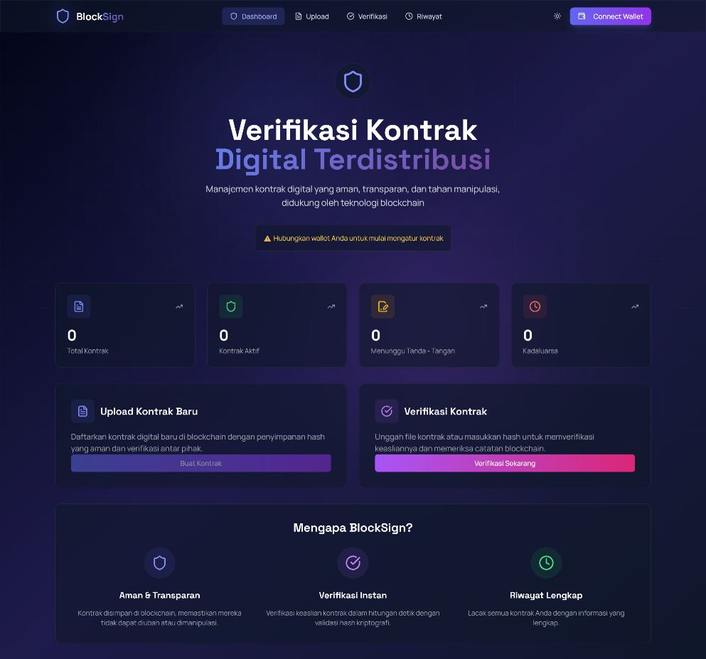
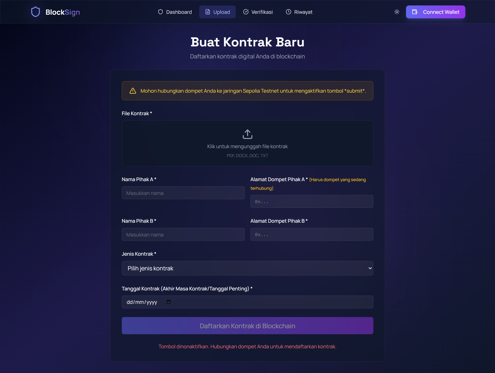
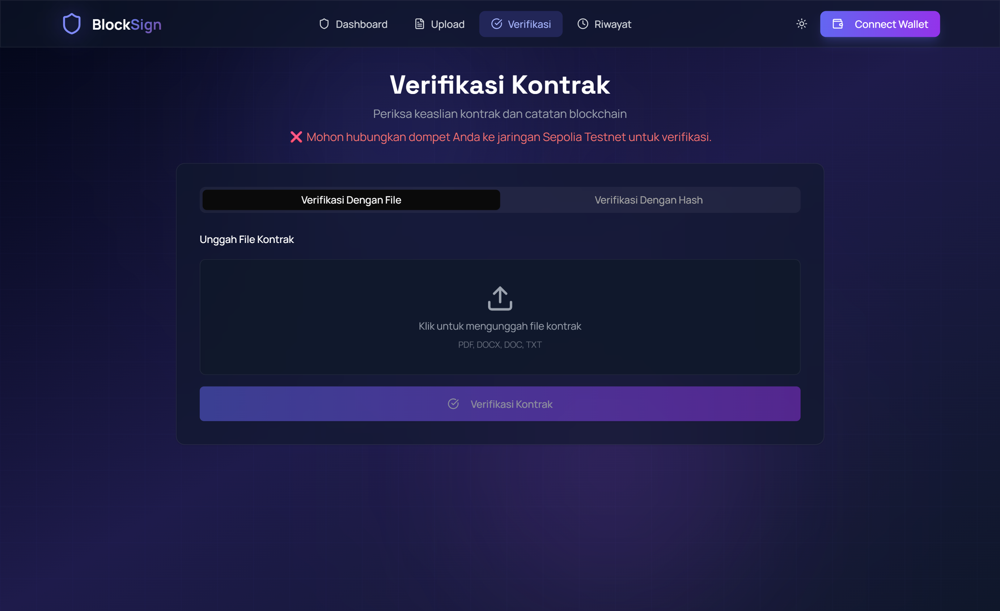
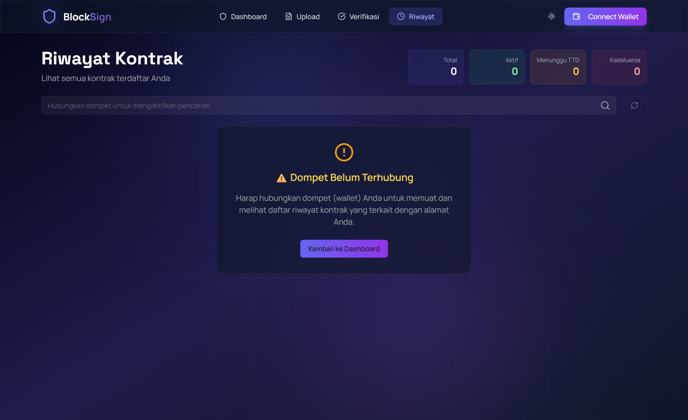
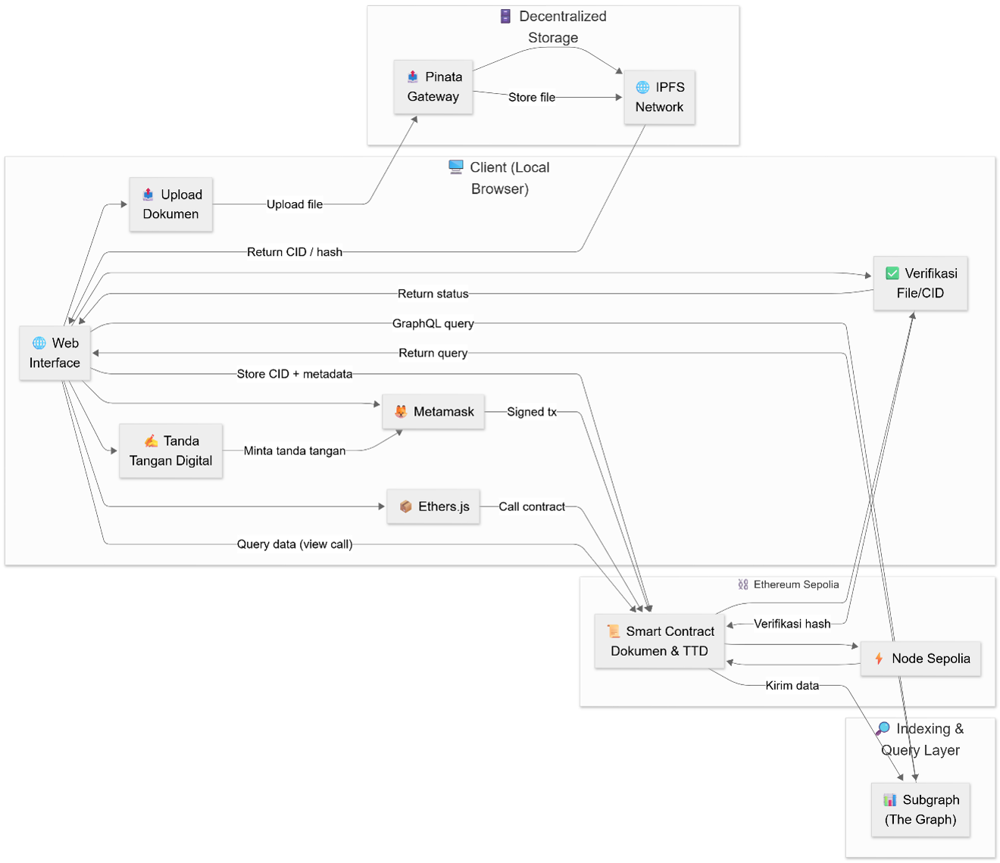
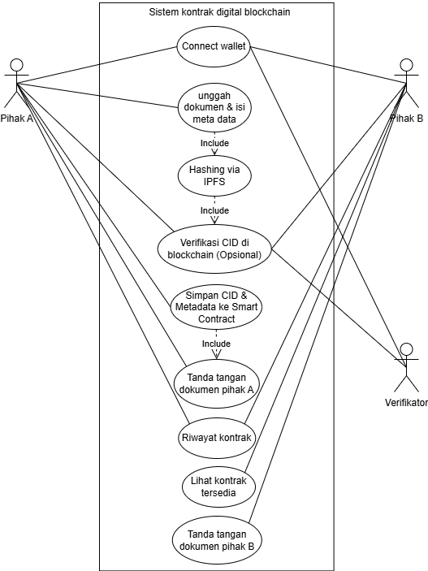
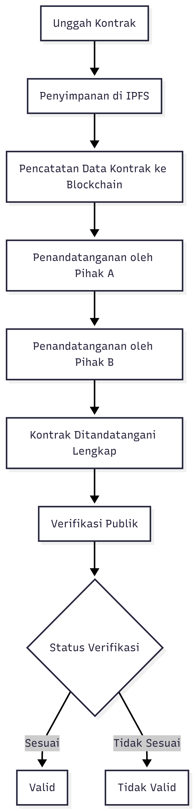

# 🧾 BlockSign

### Sistem Verifikasi Kontrak Digital Terdesentralisasi Berbasis Blockchain dan IPFS

> Implementasi Smart Contract, IPFS, dan Wallet-Based Digital Signature untuk Verifikasi Kontrak Digital yang Aman, Transparan, dan Terdesentralisasi.

---

# 📸 Tampilan Sistem

### Halaman Utama



### Halaman Upload Dokumen



### Halaman Verifikasi Dokumen



### Halaman Riwayat Kontrak



---

# 📖 Gambaran Umum

BlockSign merupakan aplikasi terdesentralisasi (*Decentralized Application / DApp*) yang dikembangkan untuk mendukung proses penandatanganan dan verifikasi kontrak digital secara aman tanpa bergantung pada pihak ketiga.

Sistem memanfaatkan kombinasi **Ethereum Smart Contract**, **IPFS (InterPlanetary File System)**, dan **MetaMask Wallet** untuk memastikan integritas dokumen, transparansi proses verifikasi, serta keamanan data kontrak yang tersimpan.

Proyek ini dikembangkan sebagai bagian dari penelitian skripsi dengan judul:

> **A Decentralized System for Dual-Signed Digital Contract Verification Using Blockchain Smart Contract and IPFS**

Universitas Islam Nahdlatul Ulama Jepara (2025).

---

# ❗ Latar Belakang Masalah

Pada sistem kontrak digital konvensional masih terdapat beberapa permasalahan, antara lain:

* Dokumen dapat diubah setelah proses penandatanganan.
* Ketergantungan pada penyimpanan terpusat (*Centralized Storage*).
* Sulit membuktikan keaslian dokumen secara independen.
* Risiko kehilangan data akibat *Single Point of Failure*.
* Kurangnya transparansi dalam proses verifikasi.

BlockSign dikembangkan untuk mengatasi permasalahan tersebut melalui pemanfaatan teknologi blockchain dan penyimpanan terdesentralisasi.

---

# 💡 Solusi yang Ditawarkan

BlockSign menawarkan pendekatan berbasis blockchain untuk memastikan integritas kontrak digital melalui kombinasi **Smart Contract**, **IPFS**, dan **Digital Signature**.

Pendekatan ini memungkinkan proses verifikasi dilakukan secara transparan tanpa memerlukan pihak ketiga sebagai validator, sehingga meningkatkan kepercayaan terhadap dokumen digital yang dipertukarkan antar pihak.

---

# 🎯 Tujuan Sistem

Sistem ini bertujuan untuk:

* Menjamin integritas kontrak digital.
* Mendukung proses *Dual Digital Signature* antara dua pihak.
* Menyimpan dokumen secara terdesentralisasi menggunakan IPFS.
* Menyediakan mekanisme verifikasi publik yang transparan.
* Mengurangi ketergantungan terhadap pihak ketiga (*Trusted Third Party*).

---

# 👨‍💻 Peran Pengembang

Proyek ini dirancang dan dikembangkan secara mandiri sebagai penelitian tugas akhir.

Ruang lingkup pekerjaan yang dilakukan meliputi:

* Requirements Analysis
* Business Process Analysis
* System Design
* Smart Contract Development
* Frontend Development
* Wallet Integration
* IPFS Integration
* Blockchain Integration
* System Testing
* Deployment pada Ethereum Sepolia Testnet

---

# 🏗️ Arsitektur Sistem



Sistem terdiri dari beberapa komponen utama:

* Frontend berbasis React.js.
* MetaMask sebagai Wallet Authentication.
* Smart Contract pada jaringan Ethereum Sepolia.
* IPFS (Pinata) sebagai penyimpanan dokumen.
* The Graph Protocol untuk indexing dan query data blockchain.

---

# 📋 Use Case Diagram



Diagram ini menggambarkan interaksi antara pengguna dan fitur utama yang tersedia pada sistem.

Aktor utama yang terlibat:

* Party A
* Party B
* Public User

Fitur utama:

* Upload Contract
* Sign Contract
* Verify Contract
* View Contract History

---

# 🔄 Alur Proses Penandatanganan Kontrak



Tahapan proses dalam sistem:

1. Party A mengunggah dokumen kontrak.
2. Dokumen disimpan ke IPFS dan menghasilkan CID.
3. CID dicatat ke dalam Smart Contract.
4. Party A melakukan Digital Signature menggunakan MetaMask.
5. Party B melakukan Digital Signature.
6. Smart Contract memverifikasi kedua tanda tangan.
7. Status kontrak berubah menjadi Fully Signed.
8. Dokumen dapat diverifikasi secara publik.

---

# ✨ Fitur Utama

### Secure Document Upload

* Upload dokumen kontrak ke IPFS.
* Menghasilkan Content Identifier (CID) unik.

### Dual Digital Signature

* Penandatanganan dilakukan oleh dua pihak secara independen.
* Verifikasi menggunakan Wallet-Based Signature.

### Blockchain Record

* Metadata kontrak disimpan secara permanen pada blockchain.
* Setiap transaksi dapat diverifikasi melalui Etherscan.

### Public Verification

* Verifikasi dokumen menggunakan CID atau file asli.
* Validasi dilakukan dengan mencocokkan hash dokumen terhadap data *on-chain*.

### Selective Access History

* Riwayat kontrak hanya dapat diakses oleh pihak yang terlibat.
* Verifikasi publik tetap tersedia tanpa membuka informasi sensitif.

---

# 🧩 Tech Stack

| Layer              | Technology                        |
| ------------------ | --------------------------------- |
| Frontend           | React.js, Tailwind CSS, Ethers.js |
| Smart Contract     | Solidity                          |
| Blockchain Network | Ethereum Sepolia                  |
| Storage            | IPFS (Pinata)                     |
| Wallet Integration | MetaMask                          |
| Indexing           | The Graph Protocol                |

---

# 📊 Hasil Implementasi

Sistem berhasil diimplementasikan dan diuji pada jaringan Ethereum Sepolia Testnet dengan kemampuan sebagai berikut:

* Upload dokumen kontrak ke IPFS.
* Penyimpanan CID dokumen pada blockchain.
* Penandatanganan kontrak menggunakan MetaMask Wallet.
* Verifikasi tanda tangan digital berbasis wallet address.
* Verifikasi dokumen menggunakan CID maupun file asli.
* Penyimpanan metadata kontrak secara permanen pada blockchain.
* Riwayat kontrak berdasarkan wallet yang terlibat.
* Verifikasi publik tanpa membuka isi dokumen.

---

# 📂 Struktur Proyek

```text
APP-BLOCKSIGN/
├── assets/
├── docs/
├── public/
├── src/
│   ├── components/
│   ├── hooks/
│   ├── lib/
│   ├── pages/
│   ├── services/
│   └── ...
├── package.json
└── README.md
```

---

# ⚙️ Instalasi

### Clone Repository

```bash
git clone https://github.com/wahyugan1/blocksign.git
cd blocksign
```

### Install Dependency

```bash
npm install
```

### Menjalankan Aplikasi

```bash
npm start
```

---

# 🔒 Security Notes

* Jangan mengunggah file `.env` ke repository publik.
* Jangan membagikan Private Key atau Seed Phrase wallet.
* Gunakan wallet khusus testnet selama proses pengembangan dan pengujian.

---

# 🎓 Kontribusi Akademik

Proyek ini menunjukkan implementasi nyata dari:

* Blockchain-Based Verification System
* Smart Contract Development
* Digital Signature Verification
* Decentralized Storage Integration
* Web3 Authentication
* Distributed Trust Architecture

dalam studi kasus verifikasi kontrak digital.

---

# 👨‍🎓 Author

**Wahyu Tri Kumolo Adi**

Sarjana Sistem Informasi
Universitas Islam Nahdlatul Ulama Jepara

📧 [wahyutrikum@gmail.com](mailto:wahyutrikum@gmail.com)

🌐 GitHub: https://github.com/wahyugan1

---

# 📄 License

MIT License
